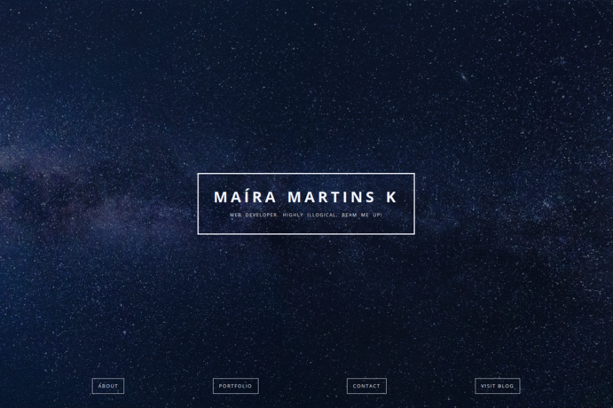

# Web Developer Portfolio

### Description & Motivation

This website is one of the required freeCodeCamp projects in the [Front End Development Certification](https://www.freecodecamp.org/map). I did it with HTML, CSS and a tiny bit of jQuery. I feel my knowledge of CSS Grids is consolidating, however my knowledge of JavaScript and jQuery is almost none at this time. I did not (and will not!) use the messy/ugly bootstrap thing.

The first thing I did was decide on a major "theme" for my website (the universe), and then sketch the project on paper. I planned how the grid would look and named the main classes. Then I created the main structure of the website on HTML. After that, I choose a Hero image on [pixabay](https://pixabay.com) and extracted a color palette from it. The CSS styling happened organically from that point on.

Overall, I feel I learned **a lot** from this project and am really proud of the result. For the future, I will make sure to learn SCSS so I can streamline the styling process and hopefully type a bit less & a lot faster...

### Tech/framework used
Made with:
* HTML
* CSS
* CSS Grids
* jQuery

