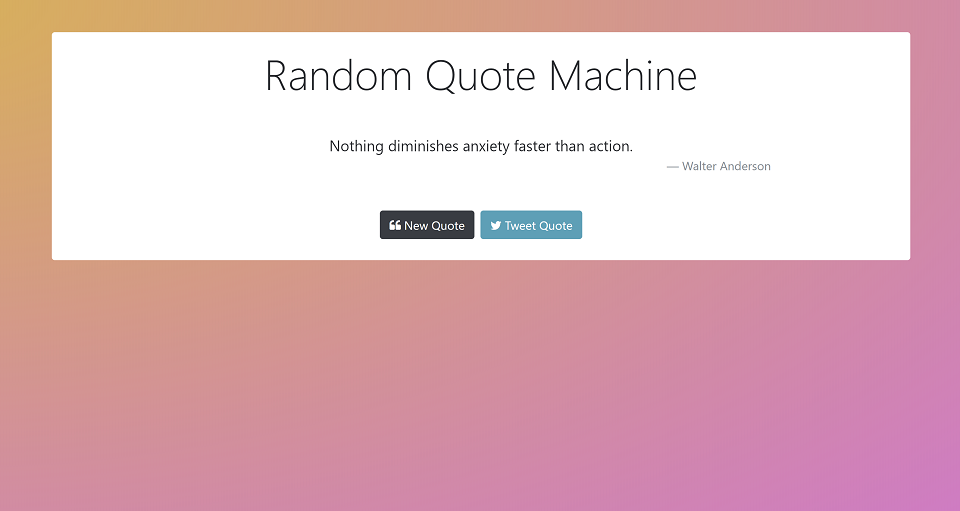

# Random Quote Generator

### Description & Motivation

This project is the first of the four Intermediate Projects required for the freeCodeCamp [Front End Development Certification](https://www.freecodecamp.org/map).

I feel like this was my first real coding experience, as I really had to work without any help from tutorials or code-along lessons. I started by creating the HTML and CSS structure, and using Bootstrap to get me a head start in terms of styling so I could focus on the JS side.

I did not remember how to access an API, so I had to watch some youtube tutorials and google a bit. First I got it working with They Said So API and it was super easy to setup, however the API is limited to 10 requests a day. Therefore, I decided to go with Forismatic API. It is useless in terms of documentation and I got stuck with CORS errors. I solved by requesting a JSONP format instead.

Finally, I tried connecting to Twitter API to post the quotes as a status update, but after googling the errors, I realized this feature was really easy to implement by using Twitter Web Intents.

I feel I learned **a ton** from this project and am really excited to finally have created a small project on my own.

### Tech/framework used
Made with love and:
* HTML
* CSS
* Bootstrap
* jQuery
* Forismatic API
* Twitter Web Intent

### Usage
Live Demo on [https://codepen.io/mairamartinsk/pen/OzbGxw](https://codepen.io/mairamartinsk/pen/OzbGxw)

