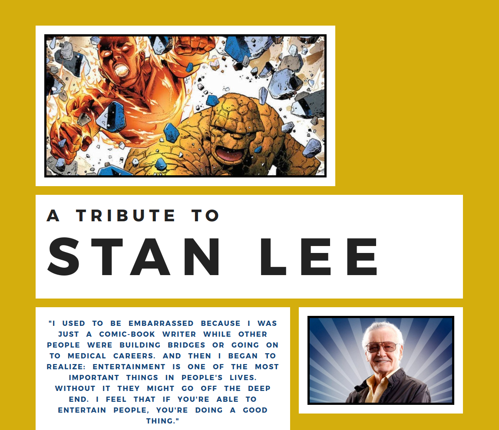

# Tribute to Stan Lee

### Description & Motivation

This is a website created with HTML and CSS for the purposes of learning about the two languages. The course tutorial encouraged the use of *Bootstrap* to make the site responsive and create grids, however I found Bootstrap cumbersome and it makes the code super messy.

After two days struggling with Bootstrap, I miraculously found a [youtube video](https://www.youtube.com/watch?v=7kVeCqQCxlk) about a new CSS feature called CSS Grid. I learned all about it in one morning, using mainly [MDN](https://developer.mozilla.org/en-US/docs/Web/CSS/CSS_Grid_Layout), and had completely finished coding my website in the afternoon. Simple, straightforward, clean code, a thing of beauty.

From freeCodeCamp's [Front End Development Certification](https://www.freecodecamp.org/map).

### Tech/framework used
Made with:
* HTML
* CSS
* CSS Grids

