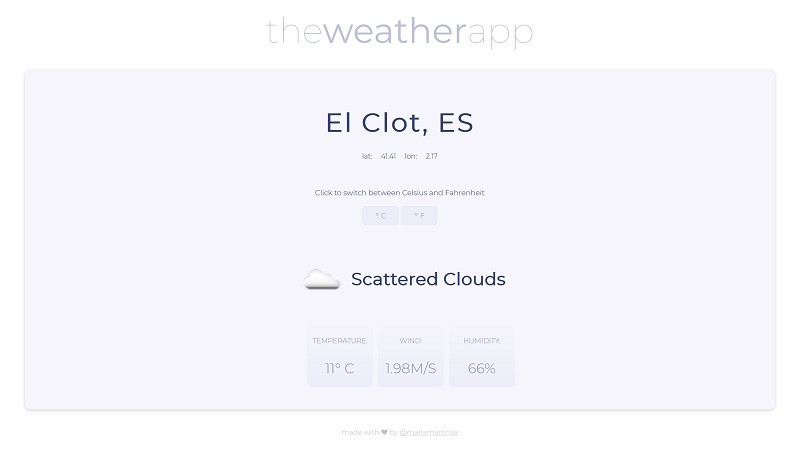

# The Weather App

### Description & Motivation

This is the second of the Intermediate Projects required for the freeCodeCamp [Front End Development Certification](https://www.freecodecamp.org/map).

Having done this project right after the [Random Quote Machine](https://github.com/mairamartinsk/freecodecamp/tree/master/quote-machine), the whole process of connecting to the API, retrieving the data and displaying it felt much easier.

The biggest challenge were the CORS issues or the need for private keys with all weather APIs I found. I ended up using FCC's own weather API to get the project done.

The UI could be improved, but I decided to focus on writing code this time. I did write all styles from scratch.

### Tech/framework used

Made with love and:

* HTML
* CSS
* jQuery
* FCC Weather API

### Usage

Live Demo on [https://codepen.io/mairamartinsk/pen/wpqqQJ](https://codepen.io/mairamartinsk/pen/wpqqQJ)

