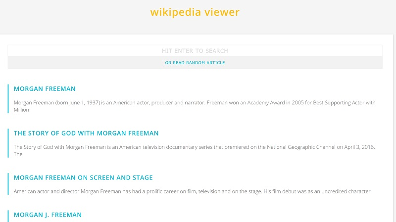

# Wikipedia Viewer

### Description & Motivation

This is the third of the four Intermediate Projects required for the freeCodeCamp [Front End Development Certification](https://www.freecodecamp.org/map).

Again, having coded this project right after the [Quote Machine](https://github.com/mairamartinsk/freecodecamp/tree/master/quote-machine) and the [Weather App](https://github.com/mairamartinsk/freecodecamp/tree/master/weather-app), the process of connecting to the API, getting its data and displaying it felt quite easy.

The Wikipedia API's documentation made me really confused at times. Those past projects really highlight how important a well-written documentation is.

As for the layout, once again I decided to style it all from scratch, to improve my design skills and get more practice with vanilla CSS.

### Tech/framework used

Made with love and:

* HTML
* CSS
* jQuery
* Wikipedia API

### Usage

Live Demo on [https://codepen.io/mairamartinsk/pen/MrrWRW](https://codepen.io/mairamartinsk/pen/MrrWRW)

